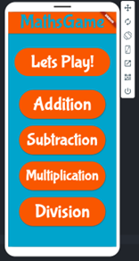
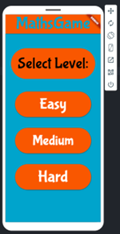
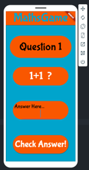

# 📱 Maths Game App

This mobile app was developed to help children improve their mental arithmetic skills in a fun and engaging way. It includes multiple difficulty levels, randomised questions, sound effects, and a scoring system. The project was built as part of a BTEC Level 3 IT coursework assignment.

## 🎮 Features

- 10-question quizzes covering addition, subtraction, multiplication, and division
- Three difficulty levels with decreasing time limits per question (10–20 seconds)
- Interactive touch-based input system for user answers
- Sound effects for correct answers and final screen
- Child-friendly, accessible UI with large buttons, simple text, and vibrant colours

## 🛠️ Tools & Technologies Used

- App Lab / Visual mobile app builder (no-code/low-code logic)
- Gantt chart planning and user feedback loops
- Testing and optimisation based on user comments
- Designed for touchscreen mobile devices with speaker/audio support

## 📸 Screenshots

## 📁 Notes

This app was developed as part of Unit 7 - Mobile App Development during my BTEC Level 3 IT course (2022–2024). All logic was implemented using a visual interface with no external libraries or traditional coding.
